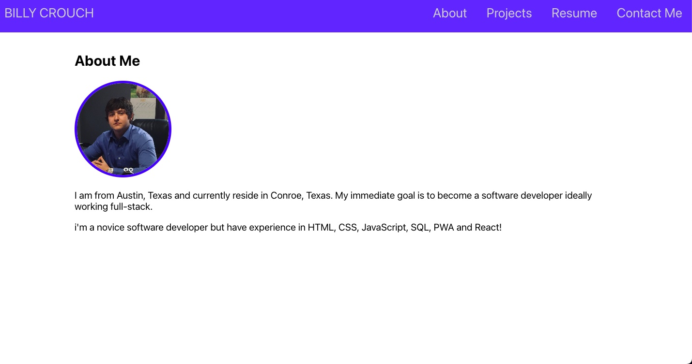

# [(React) Personal Portfolio](https://github.com/bill6653/react-portfolio)
  
## Table of Contents

* [Description](##Description)
* [Installation](##Installation)
* [Usage](##Usage)
* [Screenshot](##Screenshot)
* [Questions](##Questions)

## Description

  A portfolio made using React.

## Installation

Use the node package manager and run the following commands:  

```script
npm install
```  

## Usage

Run the following command to run the application locally:  

```script
npm start
```  

## Screenshot

()


## Questions  

Email Billy Crouch with any support questions at [billcrs512@gmail.com](billcrs512@gmail.com)\
or visit my [GitHub Homepage](https://github.com/bill6653).